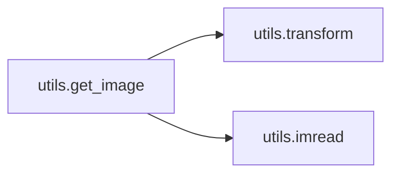
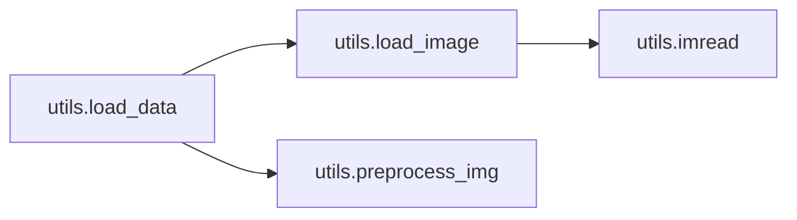
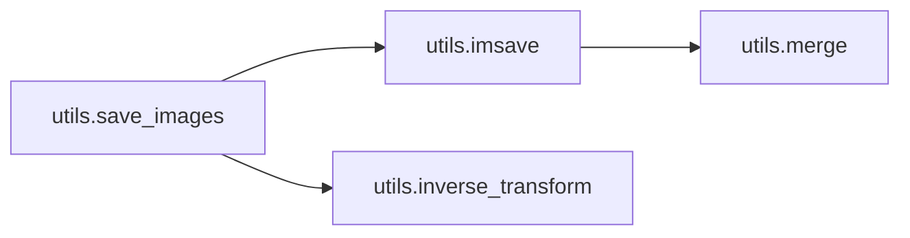

# Key Objects

[_Documentation generated by Documatic_](https://www.documatic.com)

<!---Documatic-section-utils.get_image-start--->
## utils.get_image

<!---Documatic-section-get_image-start--->


### Object Calls

* utils.transform
* utils.imread

<!---Documatic-block-utils.get_image-start--->
<details>
	<summary><code>utils.get_image</code> code snippet</summary>

```python
def get_image(image_path, image_size, is_crop=True, resize_w=64, is_grayscale=False):
    return transform(imread(image_path, is_grayscale), image_size, is_crop, resize_w)
```
</details>
<!---Documatic-block-utils.get_image-end--->
<!---Documatic-section-get_image-end--->

# #
<!---Documatic-section-utils.get_image-end--->

<!---Documatic-section-utils.imread-start--->
## utils.imread

<!---Documatic-section-imread-start--->
<!---Documatic-block-utils.imread-start--->
<details>
	<summary><code>utils.imread</code> code snippet</summary>

```python
def imread(path, is_grayscale=False):
    if is_grayscale:
        return cv2.imread(path, flatten=True)
    else:
        return cv2.imread(path)
```
</details>
<!---Documatic-block-utils.imread-end--->
<!---Documatic-section-imread-end--->

# #
<!---Documatic-section-utils.imread-end--->

<!---Documatic-section-ops.linear-start--->
## ops.linear

<!---Documatic-section-linear-start--->
<!---Documatic-block-ops.linear-start--->
<details>
	<summary><code>ops.linear</code> code snippet</summary>

```python
def linear(input_, output_size, scope=None, stddev=0.02, bias_start=0.0, with_w=False):
    shape = input_.get_shape().as_list()
    with tf.variable_scope(scope or 'Linear'):
        matrix = tf.get_variable('Matrix', [shape[1], output_size], tf.float32, tf.random_normal_initializer(stddev=stddev))
        bias = tf.get_variable('bias', [output_size], initializer=tf.constant_initializer(bias_start))
        if with_w:
            return (tf.matmul(input_, matrix) + bias, matrix, bias)
        else:
            return tf.matmul(input_, matrix) + bias
```
</details>
<!---Documatic-block-ops.linear-end--->
<!---Documatic-section-linear-end--->

# #
<!---Documatic-section-ops.linear-end--->

<!---Documatic-section-ops.deconv2d-start--->
## ops.deconv2d

<!---Documatic-section-deconv2d-start--->
<!---Documatic-block-ops.deconv2d-start--->
<details>
	<summary><code>ops.deconv2d</code> code snippet</summary>

```python
def deconv2d(input_, output_shape, k_h=3, k_w=3, d_h=2, d_w=2, stddev=0.02, name='deconv2d', with_w=False):
    with tf.variable_scope(name):
        w = tf.get_variable('w', [k_h, k_w, output_shape[-1], input_.get_shape()[-1]], initializer=tf.random_normal_initializer(stddev=stddev))
        try:
            deconv = tf.nn.conv2d_transpose(input_, w, output_shape=output_shape, strides=[1, d_h, d_w, 1])
        except AttributeError:
            deconv = tf.nn.deconv2d(input_, w, output_shape=output_shape, strides=[1, d_h, d_w, 1])
        biases = tf.get_variable('biases', [output_shape[-1]], initializer=tf.constant_initializer(0.0))
        deconv = tf.reshape(tf.nn.bias_add(deconv, biases), deconv.get_shape())
        if with_w:
            return (deconv, w, biases)
        else:
            return deconv
```
</details>
<!---Documatic-block-ops.deconv2d-end--->
<!---Documatic-section-deconv2d-end--->

# #
<!---Documatic-section-ops.deconv2d-end--->

<!---Documatic-section-utils.inverse_transform-start--->
## utils.inverse_transform

<!---Documatic-section-inverse_transform-start--->
<!---Documatic-block-utils.inverse_transform-start--->
<details>
	<summary><code>utils.inverse_transform</code> code snippet</summary>

```python
def inverse_transform(images):
    return (images + 1.0) * 127.5
```
</details>
<!---Documatic-block-utils.inverse_transform-end--->
<!---Documatic-section-inverse_transform-end--->

# #
<!---Documatic-section-utils.inverse_transform-end--->

<!---Documatic-section-main.main-start--->
## main.main

<!---Documatic-section-main-start--->


### Object Calls

* model.DualNet

<!---Documatic-block-main.main-start--->
<details>
	<summary><code>main.main</code> code snippet</summary>

```python
def main(_):
    if not os.path.exists(args.checkpoint_dir):
        os.makedirs(args.checkpoint_dir)
    if not os.path.exists(args.sample_dir):
        os.makedirs(args.sample_dir)
    if not os.path.exists(args.test_dir):
        os.makedirs(args.test_dir)
    with tf.Session() as sess:
        model = DualNet(sess, image_size=args.image_size, batch_size=args.batch_size, dataset_name=args.dataset_name, A_channels=args.A_channels, B_channels=args.B_channels, flip=args.flip == 'True', checkpoint_dir=args.checkpoint_dir, sample_dir=args.sample_dir, gcn=args.gcn, dcn=args.dcn, loss_metric=args.loss_metric, lambda_B=args.lambda_B, lambda_A=args.lambda_A, dropout_rate=args.dropout_rate, n_critic=args.n_critic, GAN_type=args.GAN_type, clip_value=args.clip_value, log_freq=args.log_freq, disc_type=args.disc_type)
        if args.phase == 'train':
            model.train(args)
        else:
            model.test(args)
```
</details>
<!---Documatic-block-main.main-end--->
<!---Documatic-section-main-end--->

# #
<!---Documatic-section-main.main-end--->

<!---Documatic-section-ops.batch_norm-start--->
## ops.batch_norm

<!---Documatic-section-batch_norm-start--->
<!---Documatic-block-ops.batch_norm-start--->
<details>
	<summary><code>ops.batch_norm</code> code snippet</summary>

```python
def batch_norm(x, name='batch_norm'):
    eps = 1e-06
    with tf.variable_scope(name):
        nchannels = x.get_shape()[3]
        scale = tf.get_variable('scale', [nchannels], initializer=tf.random_normal_initializer(1.0, 0.02, dtype=tf.float32))
        center = tf.get_variable('center', [nchannels], initializer=tf.constant_initializer(0.0, dtype=tf.float32))
        (ave, dev) = tf.nn.moments(x, axes=[1, 2], keep_dims=True)
        inv_dev = tf.rsqrt(dev + eps)
        normalized = (x - ave) * inv_dev * scale + center
        return normalized
```
</details>
<!---Documatic-block-ops.batch_norm-end--->
<!---Documatic-section-batch_norm-end--->

# #
<!---Documatic-section-ops.batch_norm-end--->

<!---Documatic-section-utils.merge-start--->
## utils.merge

<!---Documatic-section-merge-start--->
<!---Documatic-block-utils.merge-start--->
<details>
	<summary><code>utils.merge</code> code snippet</summary>

```python
def merge(images, size):
    (h, w) = (images.shape[1], images.shape[2])
    if len(images.shape) < 4:
        img = np.zeros((h * size[0], w * size[1], 1))
        images = np.expand_dims(images, axis=3)
    else:
        img = np.zeros((h * size[0], w * size[1], images.shape[3]))
    for (idx, image) in enumerate(images):
        i = idx % size[1]
        j = idx // size[1]
        img[j * h:j * h + h, i * w:i * w + w, :] = image
    if images.shape[3] == 1:
        return np.concatenate([img, img, img], axis=2)
    else:
        return img.astype(np.uint8)
```
</details>
<!---Documatic-block-utils.merge-end--->
<!---Documatic-section-merge-end--->

# #
<!---Documatic-section-utils.merge-end--->

<!---Documatic-section-ops.conv2d-start--->
## ops.conv2d

<!---Documatic-section-conv2d-start--->
<!---Documatic-block-ops.conv2d-start--->
<details>
	<summary><code>ops.conv2d</code> code snippet</summary>

```python
def conv2d(input_, output_dim, k_h=3, k_w=3, d_h=2, d_w=2, stddev=0.02, name='conv2d'):
    with tf.variable_scope(name):
        w = tf.get_variable('w', [k_h, k_w, input_.get_shape()[-1], output_dim], initializer=tf.truncated_normal_initializer(stddev=stddev))
        conv = tf.nn.conv2d(input_, w, strides=[1, d_h, d_w, 1], padding='SAME')
        biases = tf.get_variable('biases', [output_dim], initializer=tf.constant_initializer(0.0))
        conv = tf.reshape(tf.nn.bias_add(conv, biases), conv.get_shape())
        return conv
```
</details>
<!---Documatic-block-ops.conv2d-end--->
<!---Documatic-section-conv2d-end--->

# #
<!---Documatic-section-ops.conv2d-end--->

<!---Documatic-section-utils.load_data-start--->
## utils.load_data

<!---Documatic-section-load_data-start--->


### Object Calls

* utils.load_image
* utils.preprocess_img

<!---Documatic-block-utils.load_data-start--->
<details>
	<summary><code>utils.load_data</code> code snippet</summary>

```python
def load_data(image_path, flip=False, is_test=False, image_size=128):
    img = load_image(image_path)
    img = preprocess_img(img, img_size=image_size, flip=flip, is_test=is_test)
    img = img / 127.5 - 1.0
    if len(img.shape) < 3:
        img = np.expand_dims(img, axis=2)
    return img
```
</details>
<!---Documatic-block-utils.load_data-end--->
<!---Documatic-section-load_data-end--->

# #
<!---Documatic-section-utils.load_data-end--->

<!---Documatic-section-utils.imsave-start--->
## utils.imsave

<!---Documatic-section-imsave-start--->


### Object Calls

* utils.merge

<!---Documatic-block-utils.imsave-start--->
<details>
	<summary><code>utils.imsave</code> code snippet</summary>

```python
def imsave(images, size, path):
    return cv2.imwrite(path, merge(images, size))
```
</details>
<!---Documatic-block-utils.imsave-end--->
<!---Documatic-section-imsave-end--->

# #
<!---Documatic-section-utils.imsave-end--->

<!---Documatic-section-utils.transform-start--->
## utils.transform

<!---Documatic-section-transform-start--->
<!---Documatic-block-utils.transform-start--->
<details>
	<summary><code>utils.transform</code> code snippet</summary>

```python
def transform(image, npx=64, is_crop=True, resize_w=64):
    if is_crop:
        cropped_image = center_crop(image, npx, resize_w=resize_w)
    else:
        cropped_image = image
    return np.array(cropped_image) / 127.5 - 1.0
```
</details>
<!---Documatic-block-utils.transform-end--->
<!---Documatic-section-transform-end--->

# #
<!---Documatic-section-utils.transform-end--->

<!---Documatic-section-utils.preprocess_img-start--->
## utils.preprocess_img

<!---Documatic-section-preprocess_img-start--->
<!---Documatic-block-utils.preprocess_img-start--->
<details>
	<summary><code>utils.preprocess_img</code> code snippet</summary>

```python
def preprocess_img(img, img_size=128, flip=False, is_test=False):
    img = cv2.resize(img, (img_size, img_size))
    if not is_test and flip and (np.random.random() > 0.5):
        img = np.fliplr(img)
    return img
```
</details>
<!---Documatic-block-utils.preprocess_img-end--->
<!---Documatic-section-preprocess_img-end--->

# #
<!---Documatic-section-utils.preprocess_img-end--->

<!---Documatic-section-ops.celoss-start--->
## ops.celoss

<!---Documatic-section-celoss-start--->
<!---Documatic-block-ops.celoss-start--->
<details>
	<summary><code>ops.celoss</code> code snippet</summary>

```python
def celoss(logits, labels):
    return tf.reduce_mean(tf.nn.sigmoid_cross_entropy_with_logits(logits=logits, labels=labels))
```
</details>
<!---Documatic-block-ops.celoss-end--->
<!---Documatic-section-celoss-end--->

# #
<!---Documatic-section-ops.celoss-end--->

<!---Documatic-section-utils.load_image-start--->
## utils.load_image

<!---Documatic-section-load_image-start--->


### Object Calls

* utils.imread

<!---Documatic-block-utils.load_image-start--->
<details>
	<summary><code>utils.load_image</code> code snippet</summary>

```python
def load_image(image_path):
    img = imread(image_path)
    return img
```
</details>
<!---Documatic-block-utils.load_image-end--->
<!---Documatic-section-load_image-end--->

# #
<!---Documatic-section-utils.load_image-end--->

<!---Documatic-section-ops.lrelu-start--->
## ops.lrelu

<!---Documatic-section-lrelu-start--->
<!---Documatic-block-ops.lrelu-start--->
<details>
	<summary><code>ops.lrelu</code> code snippet</summary>

```python
def lrelu(x, leak=0.2, name='lrelu'):
    return tf.maximum(x, leak * x)
```
</details>
<!---Documatic-block-ops.lrelu-end--->
<!---Documatic-section-lrelu-end--->

# #
<!---Documatic-section-ops.lrelu-end--->

<!---Documatic-section-utils.merge_images-start--->
## utils.merge_images

<!---Documatic-section-merge_images-start--->


### Object Calls

* utils.inverse_transform

<!---Documatic-block-utils.merge_images-start--->
<details>
	<summary><code>utils.merge_images</code> code snippet</summary>

```python
def merge_images(images, size):
    return inverse_transform(images)
```
</details>
<!---Documatic-block-utils.merge_images-end--->
<!---Documatic-section-merge_images-end--->

# #
<!---Documatic-section-utils.merge_images-end--->

<!---Documatic-section-utils.save_images-start--->
## utils.save_images

<!---Documatic-section-save_images-start--->


### Object Calls

* utils.imsave
* utils.inverse_transform

<!---Documatic-block-utils.save_images-start--->
<details>
	<summary><code>utils.save_images</code> code snippet</summary>

```python
def save_images(images, size, image_path):
    dir = os.path.dirname(image_path)
    if not os.path.exists(dir):
        os.makedirs(dir)
    return imsave(inverse_transform(images), size, image_path)
```
</details>
<!---Documatic-block-utils.save_images-end--->
<!---Documatic-section-save_images-end--->

# #
<!---Documatic-section-utils.save_images-end--->

[_Documentation generated by Documatic_](https://www.documatic.com)